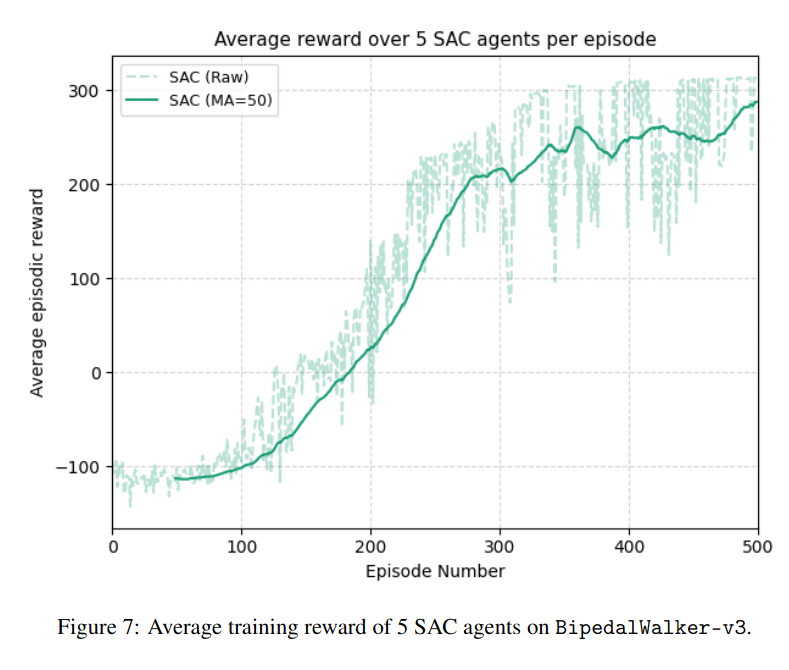

# Reinforcement Learning Project: SAC on BipedalWalker-v3

This project implements a **Soft Actor-Critic (SAC)** agent from scratch to solve the continuous control task **BipedalWalker-v3** from OpenAI Gymnasium.

## Project Context
This implementation was one component of a broader comparative study involving PPO, TD3, DDPG, and SAC.

## Project Structure

```
├── main_bipedal_walker.py   # Main training script
├── sac.py                   # SAC agent: Actor, Critic, and SAC classes
├── replay_buffer.py         # Experience replay buffer
├── config.py                # Hyperparameters for training
├── utils.py                 # Helper functions (plotting, saving models, etc.)
├── evaluate.py              # Script to evaluate a saved model
```

## Requirements

- Python 3.8+
- PyTorch
- Gymnasium
- NumPy
- Matplotlib

You can install the dependencies via:

```bash
pip install torch gymnasium matplotlib numpy
```

## Training

To train the SAC agent on **BipedalWalker-v3**:

```bash
python main_bipedal_walker.py
```

This will:
- Train 5 agents with different random seeds
- Save models and training summaries automatically
- Optionally plot reward curves and loss metrics

**Saved Models** are stored as `.pt` files (e.g., `sac_final_seed_42.pt`).

**Training Summaries** are saved as JSON files with reward history.

## Evaluation

To evaluate a saved SAC agent:

```bash
python evaluate.py
```

Make sure to update `model_path` inside `evaluate.py` if needed.
The evaluation script will:
- Run the agent deterministically over 100 episodes
- Save a plot of rewards (`evaluation_results.png`)
- Save an evaluation summary as JSON.

## Results and Comparison

In our comparative study of **DDPG, TD3, PPO, and SAC** on **BipedalWalker-v3**:

- **SAC** achieved the highest performance, with an **average evaluated return of 312.2 ± 10.5**, consistently exceeding the 300-point “solved” threshold.  
- **TD3** followed with an average of **262.5 ± 17.9**, showing strong stability but not reaching the same peak as SAC.  
- **PPO** achieved **227.3 ± 43.1**, performing well initially but plateauing around 150 during training, indicating limits in sample efficiency.  
- **DDPG** struggled, averaging **80.0 ± 180.6**, with high variance and instability.  

**Summary Table (100-episode evaluation):**

| Algorithm | Avg. Return | Std. Dev. |
|-----------|-------------|-----------|
| Random    | -100.3      | 0.9       |
| DDPG      | 80.0        | 180.6     |
| PPO       | 227.3       | 43.1      |
| TD3       | 262.5       | 17.9      |
| SAC       | **312.2**   | **10.5**  |




## Notes

- **Replay Buffer** stores (state, action, reward, next_state, done) tuples for experience replay.
- **Actor Network** outputs a mean action and samples using the reparameterization trick.
- **Critic Networks** (two Q-functions) mitigate overestimation bias.
- **Entropy Coefficient** (α) is automatically learned during training to balance exploration and exploitation.
- **Soft Updates** are applied to target networks every step.

## Authors and Contributions

The code within this repository are primarily authored by Larisa F.

The file `replay_buffer.py` was developed by my one of my group partners, Jithin C.

The comparative results come from a group project with **Rob E., Visahan S., Omar R., and Ronan S.**
